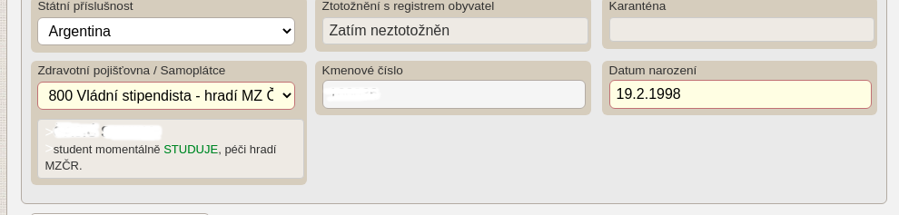
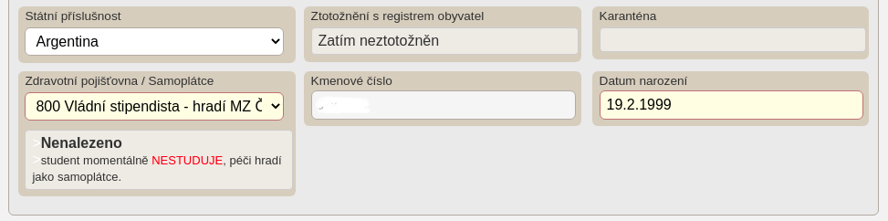
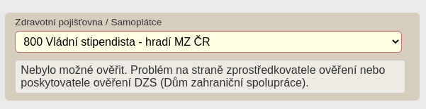

# PRO OC DZS

[Rozšíření do Mozilla Firefox](https://addons.mozilla.org/addon/pro-oc-dzs/)

Rozšíření přidává užitečné funkce za pomoci [DZS registru](http://registr.dzs.cz/dotaz.nsf) do modulu [Pacienti COVID-19](https://ereg.ksrzis.cz/Registr/CUDZadanky/VyhledaniPacienta) a [Žádanky testů COVID-19](https://eregpublicsecure.ksrzis.cz/Registr/CUD/Overeni) s cílem usnadnit práci s těmito systémy.

## Zásady ochrany osobních údajů

Osobní informace pacientů podmíněné přihlášením do modulu [Pacienti COVID-19](https://ereg.ksrzis.cz/Registr/CUDZadanky/VyhledaniPacienta) a webové aplikace [Žádanky testů COVID-19](https://eregpublicsecure.ksrzis.cz/Registr/CUD/Overeni) jsou použity pro přidání nových funkcí, které využívají [DZS registr](http://registr.dzs.cz/dotaz.nsf). **Žádná data nejsou jakkoliv zpracovávána ani jinam přeposílána.**

## Použití

Aktuálně (k 17.2.2022) nelze [DZS registr](http://registr.dzs.cz/dotaz.nsf) dotazovat automatizovaně pouze skrze prohlížeč. Je zapotřebí zadat do nastavení vlastní proxy server, který dotaz zproztředkuje, např. [PRO OC DZS Proxy](https://github.com/PRO-OC/pro-oc-vzp-b2b-cors-proxy).Defaultně se body požadavky šifrují pomocí AES knihovnou [crypto-js](https://github.com/brix/crypto-js). Toto šifrování lze vypnout v nastavení.

## Změny pro Mozilla Firefox

- Použití manifest souboru s verzí 2 ```manifest.v2.json```
- Odstranění řádku ```importScript("./../lib/crypto-js.min.js");``` ze souboru ```background/background.js``` 

## Žádanky testů COVID-19

- Při vystavování žádanky provádí kontrolu pomocí kmenového čísla a data narození.






